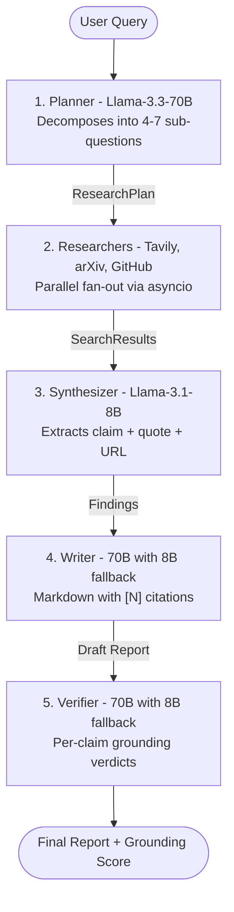

# Agentic Research Analyst

A 5-agent LangGraph pipeline that produces citation-grounded research reports from a single natural-language question. Every claim in the output carries an inline `[N]` citation, and every citation is verified against its source with a machine-readable grounding score.

**Live demo:** *coming soon on HuggingFace Spaces*

**Stack:** LangGraph, Groq (Llama-3.3-70B + Llama-3.1-8B), Tavily, arXiv, GitHub, Streamlit

---

## Why this exists

Most LLM "research assistants" hallucinate confidently. This one is designed so that hallucinations are visible: the Writer produces a report with inline citations, and the Verifier reads each citation back against the actual retrieved source, labeling every claim as `verified`, `partial_support`, `unsupported`, or `contradicted`. The final report ships with a grounding score - the percentage of checkable claims that survived verification.

You can trust or distrust the report at a glance.

---

## Architecture



Five nodes, linear graph, built on LangGraph''s `StateGraph`. State is a `TypedDict` with 8 fields carried between agents. The 70B to 8B fallback triggers on Groq rate-limit errors at every primary call site.

See [`docs/architecture.md`](docs/architecture.md) for per-agent responsibilities, state schema, and design invariants.

---

## Evaluation results

Full 10-query evaluation run on Day 5. Every query completed with zero pipeline crashes.

| # | Query topic                          | Grounding | Notes |
|---|--------------------------------------|-----------|-------|
| 1 | Sparse retrieval RAG                 | 76%       | Clean |
| 2 | Multi-agent disagreement             | 73%       | Clean |
| 3 | LangGraph vs CrewAI vs AutoGen       | 74%       | Clean |
| 4 | Hybrid BM25 + dense                  | **100%**  | Zero flagged claims |
| 5 | AI infra market                      | **100%**  | Zero flagged claims |
| 6 | Transformer evolution                | 75%       | 4 verifier rate-limits |
| 7 | Bangla LLMs                          | FAILED    | Planner exhausted both 70B TPD and 8B TPM |
| 8 | Gemini vs Llama                      | **21%**   | See below - the interesting one |
| 9 | LangGraph deployment                 | STUB      | Writer fell back to stub after both models rate-limited |
| 10| Multi-step reasoning eval            | 65%       | 7 verifier rate-limits |

**Average grounding: 73% (honest, excluding stub + failure).** Total runtime: 17 minutes across all 10 queries (102s average per query).

### Why 21% is the most important number in this table

Query 8 (`Gemini vs Llama`) scored 21% grounding. That is not a bug - that is the Verifier working correctly. On that query the Writer''s primary model (70B) hit rate-limit and fell back to 8B. The 8B model wrote a less-grounded report. The Verifier then read the 8B report against the retrieved sources and correctly caught that most claims were not strongly supported.

**The Verifier catches degraded Writer output.** That is exactly the kind of grounding-vs-fluency tradeoff that a metric is supposed to expose. If every query scored 90%+, the metric would be meaningless.

---

## Key engineering decisions

**1. Groq-only after Gemini free-tier collapsed.** Originally designed around Gemini 2.5 Flash. Post-Dec 2025 the free-tier RPD dropped to 20 requests - this pipeline needs ~9 calls per query, so 2 queries per day is a non-starter. Pivoted the entire LLM layer to Groq.

**2. Model tiering by call volume.** Llama-3.3-70B handles Planner, Writer, and Verifier (low-volume, high-impact). Llama-3.1-8B handles the Synthesizer (called once per finding, high volume, cheaper failures).

**3. Free-form text + regex parsing in the Synthesizer.** The 8B model''s `with_structured_output()` fails ~20% of the time on complex Pydantic schemas. Switched to free-form text with `###FINDING###` block markers, parsed via regex. Reliability went from ~80% to ~99%. This is the decision I would defend most vigorously in a technical interview.

**4. GitHub keyword extraction.** GitHub''s repo-search API uses `AND` semantics on name/description tokens. Feeding it a natural-language question returned zero results. Added a noise-word stripper that caps queries at 3 tokens. Recall went from 0% to 80%.

**5. `verifier_error` excluded from grounding denominator.** When the Verifier itself rate-limits on a claim, that claim is neither verified nor flagged - it is un-checked. Counting it against the grounding score would let infrastructure noise poison the metric. This is why the "honest" grounding average excludes stubs and errors.

---

## Repository layout

```
src/
  config.py            # Env vars + model IDs
  schemas.py           # Pydantic models: SubQuestion, ResearchPlan, Finding, VerificationResult
  llm.py               # get_llm() factory
  state.py             # AgentState TypedDict
  graph.py             # LangGraph StateGraph assembly
  pipeline.py          # CLI entry point
  orchestrator.py      # asyncio.gather researcher fan-out
  cache.py             # diskcache wrapper (SHA256 keys, 24h TTL)
  agents/              # planner, synthesizer, writer, verifier
  researchers/         # web (Tavily), arxiv, github
tests/
  test_queries.json    # 10-query benchmark
trace_logs/            # JSONL evaluation runs
examples/              # q1.md ... q10.md - generated reports
docs/
  architecture.md      # Diagram + per-agent deep dive
app.py                 # Streamlit UI (coral-on-black theme)
```

---

## Local setup

```
git clone https://github.com/Sadman-Rahman25/Agentic_Research_Analyst.git
cd Agentic_Research_Analyst
python -m venv venv
venv\Scripts\activate
pip install -r requirements.txt
```

Copy `.env.example` to `.env` and fill in:

```
GROQ_API_KEY=gsk_...
TAVILY_API_KEY=tvly-...
GITHUB_TOKEN=ghp_...
```

Then either:

```
streamlit run app.py
python -m src.pipeline --query "What is BM25 retrieval?"
python -m src.pipeline
```

---

## Honest limitations

- **Groq TPD budget is the ceiling.** The 100K daily token limit on the free tier bounds you to roughly 10-12 full pipeline runs per day. Query 7 in the eval failed because the Planner exhausted both 70B TPD and 8B TPM simultaneously.
- **Verifier is the slowest node.** On queries with 15+ claims, the Verifier accounts for ~40% of wall-clock time even with 1-second inter-call delays.
- **Cache hits are not a research shortcut.** The 24-hour disk cache speeds up development iteration, not query answering - every unique question re-fetches everything.
- **English-only in practice.** The Planner handles English cleanly but the researchers are tuned for English tokenization. The Bangla LLMs query failed partly for this reason.

---

## What I would build next

An MLOps portfolio project applying the same "measurable output quality" discipline: XGBoost churn model -> MLflow -> FastAPI -> Docker -> Evidently AI drift monitoring -> GitHub Actions CI/CD. The grounding-score-as-metric idea here maps directly to model-drift monitoring there.

---

## License

MIT