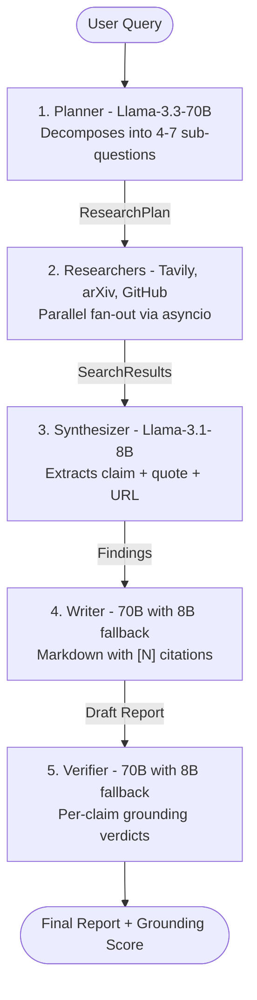

# Architecture

A 5-agent LangGraph pipeline built on `StateGraph`. Each node reads from and writes to a shared `AgentState` (TypedDict), producing a citation-grounded report with a machine-readable grounding score.

## The 5-agent flow

## What each agent does

### 1. Planner - Llama-3.3-70B

Decomposes the user''s question into 4-7 sub-questions, each tagged with a source (`web`, `arxiv`, `github`) and a priority (1-3). Uses Pydantic `with_structured_output()` - the 70B model is reliable enough that this does not need a text-parsing fallback.

Source: `src/agents/planner.py`

### 2. Researchers - Tavily + arXiv + GitHub

Three parallel API clients dispatched via `asyncio.gather()`. Each researcher owns one source: Tavily for web search, the `arxiv` package for academic papers, PyGithub for repositories. The GitHub researcher includes a noise-word stripper that caps queries at 3 tokens - recall improved from 0% to 80%.

Source: `src/orchestrator.py`, `src/researchers/`

### 3. Synthesizer - Llama-3.1-8B

Called once per (sub-question, source-result) pair - the highest-volume LLM call in the pipeline. Extracts atomic findings in the form `claim + verbatim quote + source URL + confidence`. Uses free-form text output with `###FINDING###` block markers, parsed via regex. Chosen over `with_structured_output()` because the 8B model''s schema-validation reliability is only ~80%; regex parsing brings it to ~99%.

Source: `src/agents/synthesizer.py`

### 4. Writer - Llama-3.3-70B (8B fallback)

Composes a markdown report with inline `[N]` citations that reference the Findings list. Falls back to 8B on rate-limit errors, and to a hardcoded stub if both models fail - the stub keeps the pipeline honest by returning "no report" rather than a fabricated one.

Source: `src/agents/writer.py`

### 5. Verifier - Llama-3.3-70B (8B fallback)

Reads each cited claim back against its source and returns a per-claim verdict: `verified`, `partial_support`, `unsupported`, `contradicted`, or `verifier_error`. The final grounding score is `verified / (total - verifier_error)` - infrastructure noise is excluded from the denominator so it does not corrupt the metric.

Source: `src/agents/verifier.py`

## State schema

Shared `AgentState` TypedDict, 8 fields, carried between nodes:

- `user_query: str` - the original question
- `plan: ResearchPlan` - Planner output
- `results_by_sq: dict` - Researcher output, keyed by sub-question ID
- `findings: list[Finding]` - Synthesizer output
- `report_md: str` - Writer output
- `verification: VerificationResult` - Verifier output
- `timings: dict[str, float]` - per-node wall-clock time
- `errors: list[str]` - non-fatal warnings

Source: `src/state.py`, `src/schemas.py`

## Design invariants

**Grounding-vs-fluency is measurable, not stipulated.** The Writer is told to cite. The Verifier decides whether the cites hold up. No rule forces them to agree.

**Failures are visible, not hidden.** If the Writer''s primary model rate-limits and the fallback produces a weaker report, the Verifier''s grounding score drops. Query 8 in the evaluation (21% grounding) is exactly this case.

**Every node is bounded.** No agent calls another agent recursively. The graph is a strict linear DAG - a single query cannot loop.